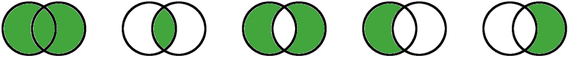

# venn: set operations with a command line shell script

The `venn` command does set operations on the shell command line,
for example to process text files and do set union, set intersection, etc.

* [Introduction](#introduction)
  * [Syntax](#syntax)
  * [Set operations](#set-operations)
  * [Options](#options)
  * [Examples](#examples)
* [Set operations details](#set-operations-details)
  * [Union](#union)
  * [Intersection](#intersection)
  * [Difference](#difference)
  * [Except a.k.a. First](#except-a-k-a-first)
  * [Extra a.k.a. Last](#extra-a-k-a-last)
  * [Disjoint](#disjoint)
* [Customization](#customization)
  * [Custom output for true or false](#custom-output-for-true-or-false)
* [Implemenation](#implemenation)
* [TODO](#todo)
* [References](#references)
* [Tracking](#tracking)

## Introduction

Script: [venn](bin/venn)

### Syntax

Syntax:

    venn (union|intersection|...) <input> ...

Syntax example:

    venn union file-1.txt file-2.txt file-3.txt

### Set operations

Set operations that venn can process:

  * union: A ∪ B (lines that are in any input stream)

  * intersection: A ∩ B (lines that are in all input streams)

  * difference: A ⊕ B (lines that are in one input stream)

  * except: A - B (lines that are solely in the first input steam)

  * extra: B - A (lines that are solely in the last input stream)

  * joint: is any line in more than one input stream?

  * disjoint: is each line in exactly one input stream?

### Options

Options on the command line:

  * `-h` `--help`: show help

  * `-v` `--version`: show version

### Examples

Examples use these two example data files:

    $ cat a
    red
    green

    $ cat b
    red
    blue

Union:

    $ venn union a b
    red
    green
    blue

Intersection:

    $ venn intersection a b
    red

Difference:

    $ venn difference a b
    green
    blue

Except:

    $ venn except a b
    green

Extra:

    $ venn extra a b
    blue

Disjoint:

    $ venn disjoint a b
    false

## Set operations details

### Union

Set theory operation (A union B).

Print lines that are in any of the input streams.

Also known as "logical or", "logical inclusive disjunction".

Synonyms:

  * `union`

  * `u` (letter u)

  * `∪` (U+222A union)

  * `∨` (U+2228 logical or)

  * `+` (U+002B plus sign)

  * `&` (U+0026 ampersand)

  * `or`

Example:

    $ venn union a b c
    $ venn or a b c
    => print lines that are in any of a, b, c

### Intersection

Set theory operation (A intersection B).

Print lines that are in all of the input streams.

Also known as "logical and", "logical conjunction".

Synonyms:

  * `intersection`

  * `i` (letter i)

  * `∩` (U+2229 intersection)

  * `∧` (U+2227 logical and)

  * `|` (U+007C vertical line)

  * `and`

Example:

    $ venn intersection a b c
    $ venn and a b c
    => print lines that are in all of a, b, c

### Difference

Set theory operation (A symmetric difference B).

Print lines that are in one of the input streams.

Also known as "logical xor", "logical exclusive disjuntion".

Synonyms:

  * `difference`

  * `d` (letter d)

  * `⊕` (U+2295 circled plus)

  * `∆` (U+2206 increment)

  * `Δ` (U+0394 delta)

  * `⊻` (U+22BB logical xor)

  * `xor`

Examples:

    $ venn difference a b c
    $ venn xor a b c
    => print lines that are in one of a, b, c

### Except a.k.a. First

Set operation (A except B) a.k.a. (A - B)

Print lines that are solely in the first input.

Synonyms:

  * `except`

  * `first`

  * `sub` 
  
  * `subtract`
  
  * `subtraction`

  * `-` (U+2212 minus sign)

Examples:

    $ venn except a b c
    $ venn first a b c
    => print lines that are in a, not b, c

### Extra a.k.a. Last

Set theory operation (A extra B) a.k.a. (B - A).

The lines that are solely in the last input.

Synonyms:

  * `extra`

  * `last`

Examples:

    $ venn extra a b c
    $ venn last a b c
    => print lines that are in c, not a, b

### Joint

Set operation is (A joint B).

Do any of the input streams have any overlap i.e. any lines in common?

If so, print $TRUE and exit 0, otherwise $FALSE and exit 1.

Synonyms:

  * `joint`

  * `codependent`

Examples:

    $ venn joint a b c
    $ venn codependent a b c
    => print "true" if any of a, b, c, have any lines in common
    => print "false" otherwise

 
    

### Disjoint

Set operation is (A disjoint B).

Do all of the input streams have no overlap i.e. no lines in common?

If so, print $TRUE and exit 0, otherwise $FALSE and exit 1.

Also known as "pairwise disjoint", "mutually disjoint".

Synonyms:

  * `disjoint`

  * `independent`

Examples:

    $ venn disjoint a b c
    $ venn independent a b c
    => print "true" if all of a, b, c, have no lines in common
    => print "false" otherwise

## Customization

### Custom output for true or false

The `joint` operation and the `disjoint` operation produce output that is either true or false.

Example:

    $ venn joint a b
    true

    $ venn disjoint a b
    false

You can customize the output text by using environment variables:

    $ TRUE=yes FALSE=no venn joint a b
    yes

We like to customize the output text by using environment variables and the Unicode symbols `⊤` (U+22A4 down tack) and `⊥` (U+22A5 up tack) like this:

    $ TRUE=⊤ FALSE=⊥ venn joint a b
    ⊤

## Implemenation

This command is currently implemented using `awk` and POSIX.

The goal is to maximize usability on a wide range of Unix systems, including older systems, and pure POSIX systems.

## TODO

Ideas to implement:

  * Add a "--help" option?

  * Add a way to automatically do unique? 

  * Add exception handling, such as if an input stream is not unique?

Want to help? We welcome help. You can open a GitHub issue, or send a GitHub pull request, or email us at sixarm@sixarm.com.

## References

Documentation:

* [Benchmarks](doc/benchmarks.md): Benchmarks of millions of lines of data, such as random unsorted data.
* [Comparisons](doc/comparisons.md): Comparisons to other implementations, such as Unix/POSIX shell scripts.

See also:

* [Set operations with uniq](http://blog.deadvax.net/2018/05/29/shell-magic-set-operations-with-uniq/)
* [Hacker News discussion](https://news.ycombinator.com/item?id=17183092)

Contributors, advisors, thanks:

* [Joel Parker Henderson](https://github.com/joelparkerhenderson)
* [Markus Krüger](https://github.com/markusbk)
* [Brian Pitts](https://github.com/sciurus)

## Tracking

* Program: venn
* Version: 4.3.0
* Created: 2017-01-30
* Updated: 2018-06-01
* License: GPL
* Contact: Joel Parker Henderson (joel@joelparkerhenderson.com)
